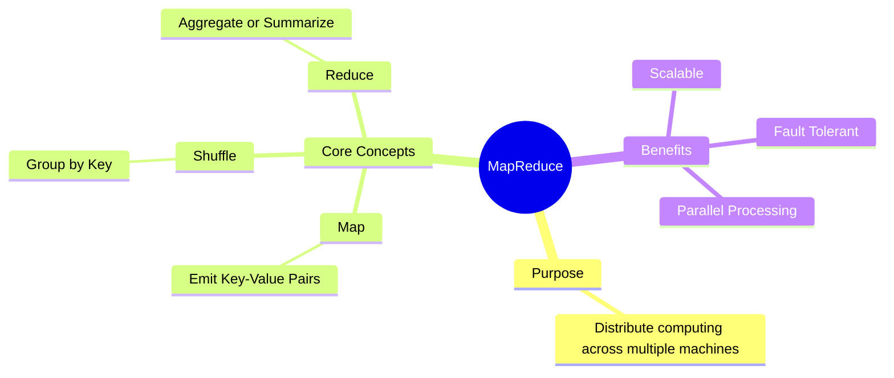
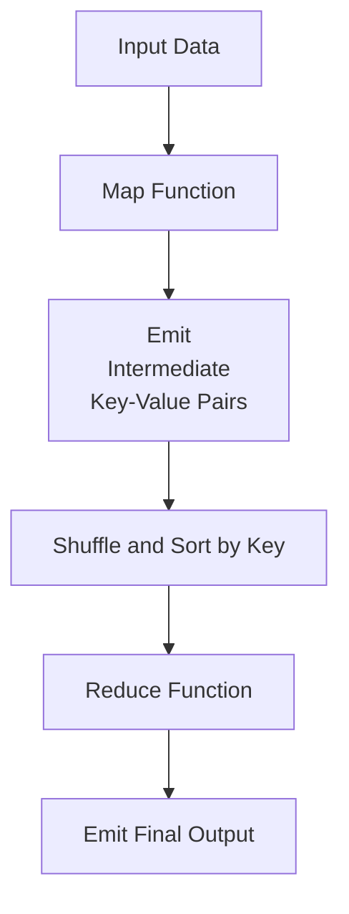
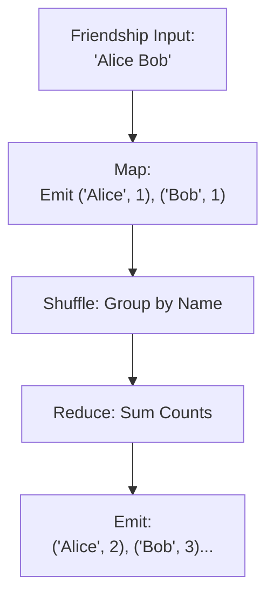
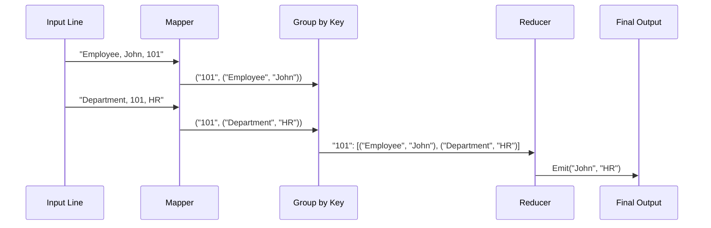
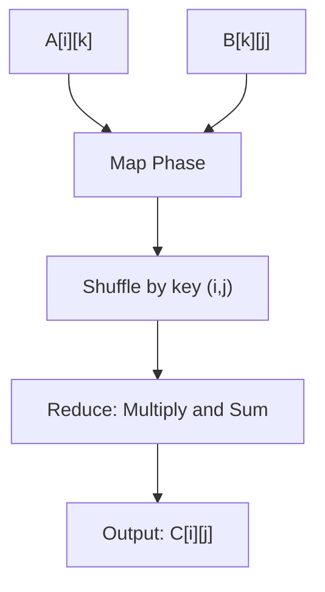
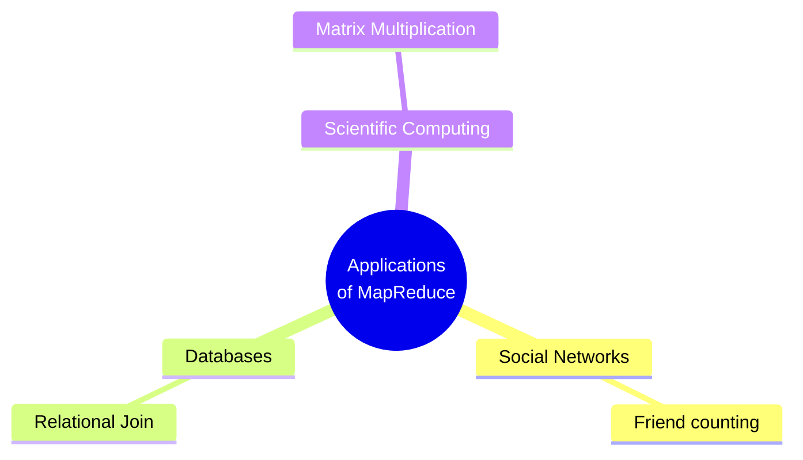

# 🧠 Learning MapReduce with Examples

This visual guide introduces MapReduce and explains how it can be used in three distinct real-world scenarios using **Python**.

---

## 🧭 What is MapReduce?



MapReduce is a programming model for processing large datasets using parallel, distributed algorithms. It simplifies data analysis by breaking it into small, manageable tasks.

---

## ⚙️ Anatomy of MapReduce



- **Map**: Takes input and emits key-value pairs.
- **Shuffle/Sort**: Groups values by key.
- **Reduce**: Processes all values for a given key.

---

## 🧑‍🤝‍🧑 Example 1: Count Number of Friends per Person

### 📝 Description
Input: Pairs of friendships  
Output: Number of friends each person has



**Input Format**
```
Joe Sue
Sue Phi
Phi Joe
Phi Alice
```

**Map Function**
```python
def mapper(inputRecord):
    persons = inputRecord.split()
    mapReducer.emitIntermediate(persons[0], persons[1])
    mapReducer.emitIntermediate(persons[1], persons[0])
```

**Reduce Function**
```python
def reducer(person, list_of_friends):
    reducedRecord = [person, len(list_of_friends)]
    mapReducer.emit(reducedRecord)
```

---

## 🗄️ Example 2: Natural Join (Employee ↔ Department)

### 📝 Description
Input: Two tables (Employee, Department)  
Output: Join records where `employee.dept_id = department.id`



**Input Format**
```
Department,1234,Sales
Employee,Susan,1234
Department,1233,Marketing
Employee,Joe,1233
Department,1233,Accounts
```

**Map Function**
```python
def mapper(record):
    myrecord = record.replace('\n', '')
    fields = myrecord.split(',')
    if fields[0] == 'Department': 
        mapReducer.emitIntermediate(fields[1], fields[2] + '_dept_');  
    else:
        mapReducer.emitIntermediate(fields[2], fields[1] + '_emp_');
```

**Reduce Function**
```python
def reducer(key, list_of_values):
    depts = []
    emps = []
    for record in list_of_values:
        fields = record.split('_')
        if(fields[1] == 'dept'):
            depts.append(fields[0])
        else:
            emps.append(fields[0])
    for dept in depts:
        for emp in emps:
            mapReducer.emit((key, emp, dept))
```

---

## 🧮 Example 3: Matrix Multiplication A x B

### 📝 Description
Input: Matrix A and B as tuples  
Output: Resultant Matrix C



**Input Format**
```
# Matrix A (3 rows and 2 columns)
2 3
4 5
2 3

# Matrix B (2 rows and 3 columns)
2 4 5
3 6 7
```

**Map Function**
```python
# The mapper is; {m1RowId, [(m1Row, m2Col1), (m1Row, m2Col2), ... , (m1Row, m2Coln)]}
def mapper(matrix1, matrix2):
    m1RowLen = len(matrix1)
    m2ColLen = len(matrix2[0])
    m2RowLen = len(matrix2)
    for i in xrange(0, m1RowLen):
        m1CurrRow = matrix1[i]
        for j in xrange(0, m2ColLen):
            currCol = []
            for k in xrange(0, m2RowLen):
                currCol.append(matrix2[k][j])
            mapReducer.emitIntermediate(i, [m1CurrRow, currCol])
```

**Reduce Function**
```python
# In the reducer; key is the row id of the answer matrix
def reducer(key, list_of_values):
    for j in xrange(0, len(list_of_values)):
        value = list_of_values[j]
        m1Row = value[0]
        m2Col = value[1]
        result = 0
        for i in xrange(0, len(m1Row)):
            result += m1Row[i] * m2Col[i]
        mapReducer.emit([key, j, result])
```

---

## 🧪 How to Run

```bash
# Count number of friends
python3 no_of_friends_map_reduce.py < inputs/friends.txt

# Relational join
python3 relational_join_map_reduce.py < inputs/relations.txt

# Matrix multiplication
python3 matrix_multiplication_map_reduce.py < inputs/matrices.txt
```

---

## ✅ Folder Structure

```
.
├── inputs/
│   ├── friends.txt
│   ├── relations.txt
│   └── matrices.txt
├── no_of_friends_map_reduce.py
├── relational_join_map_reduce.py
├── matrix_multiplication_map_reduce.py
└── README.md
```

---

## 🎯 Summary



MapReduce is a powerful abstraction for scalable data processing. Through these three examples, we saw its versatility — from counting relationships to mimicking SQL joins and even matrix algebra.

---


